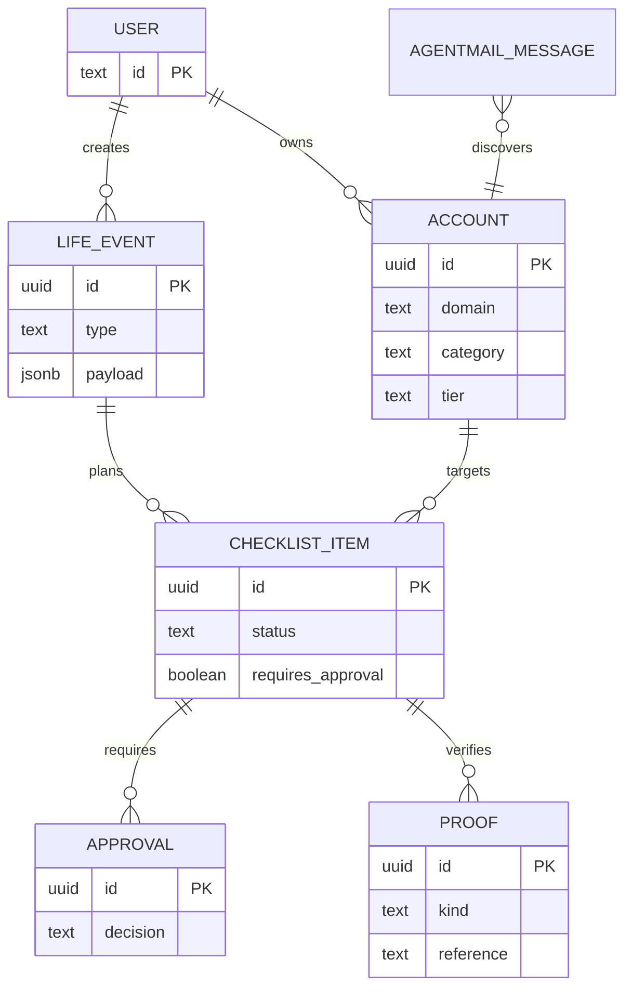

# Functional data model

Runtime flow: AgentMail → Nest discovery → Neon AI Gateway classification → Neon Postgres account graph → guarded API → Next.js UI. Neon Auth supplies the user identity for every persisted record.