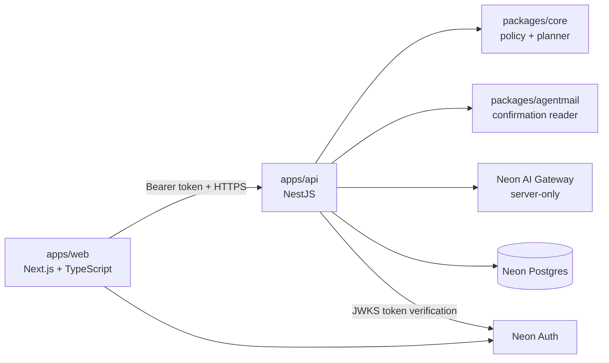
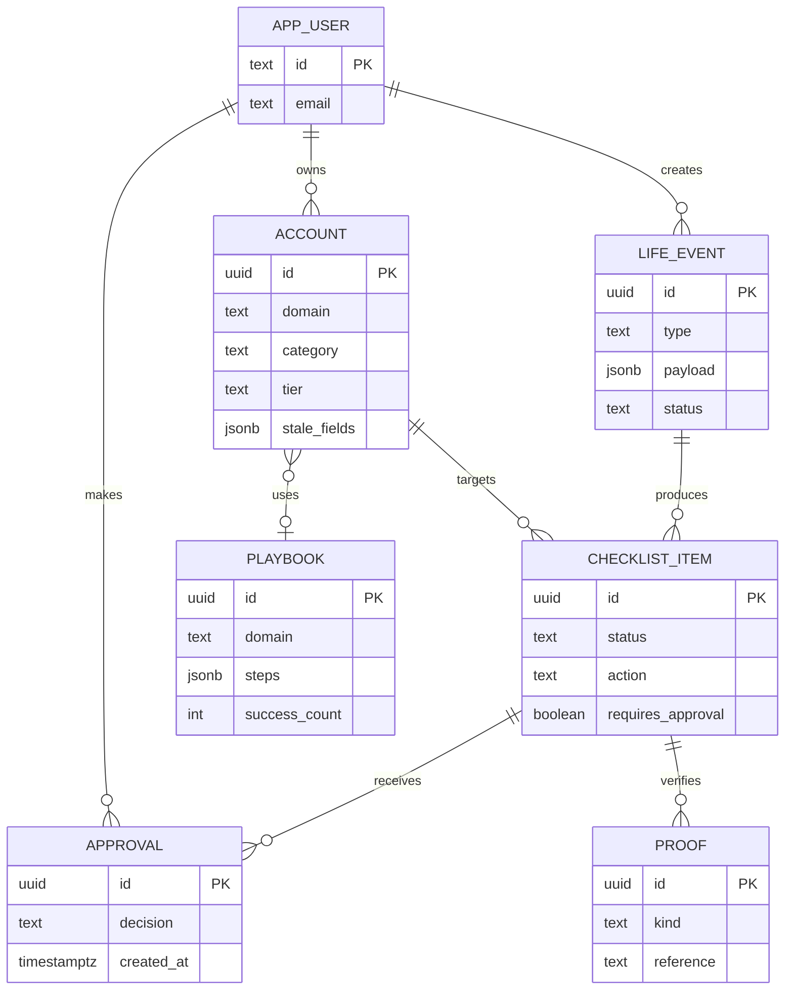

# Data model and application boundaries

The product has three deployable applications and shared packages.

## Persistent model

## Ownership and safety

- **Web** never receives AgentMail, database, or AI Gateway secrets.
- **API** is the policy-enforcement point. `NeonAuthGuard` validates bearer tokens against Neon Auth’s JWKS before protected routes run.
- **Core** computes deterministic tiers, rules, and approval requirements. An LLM may explain or classify, but cannot authorize execution.
- **Postgres** records the durable account graph, event plan, approvals, and verification proofs.
- **AgentMail** supplies evidence and one-time codes to the API; it is not accessible from the browser.